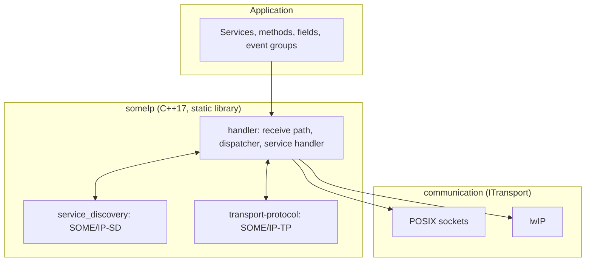

# embeddedSOME/IP

**An open-source SOME/IP stack for resource-constrained targets**, with SOME/IP-SD and
SOME/IP-TP, a hardware abstraction layer, and static, pool-based memory management. It runs on
STM32H7 microcontrollers as well as POSIX hosts and stays interoperable with
[vSomeIP](https://github.com/COVESA/vsomeip), the COVESA reference implementation. Follows
AUTOSAR release R24-11.


---

## What is embeddedSOME/IP?

SOME/IP is the primary communication protocol of AUTOSAR Adaptive. Existing open
implementations assume a full POSIX system with a heap. embeddedSOME/IP lets you run the same
protocol on a microcontroller, and gives you a host build of the identical code to test
against and benchmark.

It wires together three layers behind one entry point, `ESomeIp.hpp`:



- **`src/someIp`** is the library. The handler layer owns the receive path and dispatches
  requests to registered services. Service discovery and the transport protocol sit beside
  it and share the same pools.
- **`ITransport`** is the hardware abstraction layer. `LinuxUdpTransport` and
  `LinuxTcpTransport` use BSD sockets; `LwipUdpTransport` and `LwipTcpTransport` use lwIP on
  the microcontroller. Nothing above this interface knows which one is in use.
- **`utils`** holds the static containers, pool allocators and timers that replace the
  heap. The library is built with `-fno-exceptions` and does not allocate after
  initialization.

## Features

- **SOME/IP, SOME/IP-SD and SOME/IP-TP.** Request/response, fire-and-forget, fields and
  event groups, offers, finds, subscriptions, and segmented transfer of large payloads.
- **Static memory.** Pool-based allocation sized at compile time through
  `config/StackConfig.hpp`. Integration tests assert that no heap allocation happens after
  initialization.
- **Two platforms, one code base.** POSIX is the default; the STM32 build is a compile-time
  opt-in.
- **Interoperable with vSomeIP.** Two-container Docker setups in [`interop/`](interop/README.md)
  exercise events and request/response across both stacks over UDP.
- **Benchmarks included.** T1 to T5 measure latency, discovery time and TP throughput
  against an STM32 server; B1 and B3 give the plain-UDP floor.
- **Tracing.** Optional LTTng tracepoints, see [`src/tracepoints`](src/tracepoints/README.md).

## Quick start

Requires CMake 3.15 or newer, a C++17 compiler and pthreads.

```console
cmake -S . -B build
cmake --build build -j
```

Run a demo pair on loopback:

```console
./build/examples/D3_field_server &
./build/examples/D3_field_client
```

Run the tests:

```console
ctest --test-dir build --output-on-failure
```

## Build options

The library is built as the static target `someIp` with `-fno-exceptions`.

| Option | Default | Effect |
|---|---|---|
| `SOMEIP_BUILD_APPS` | `ON` | build the examples |
| `SOMEIP_BUILD_TESTS` | `ON` | build the tests |
| `SWEEP_TRANSPORT` | `UDP` | transport for T1 to T5, must match the board's `SOMEIP_TRANSPORT` |

The platform is chosen by the `SOMEIP_PLATFORM_STM32` macro, switched in
`src/someIp/config/config.hpp`. POSIX is the default and STM32 is opt-in. The macro is a
compile-time define, not a CMake option; the STM32 build is controlled by the CubeIDE
project in [embeddedSOMEIP-STM32](https://github.com/embedded-software-laboratory/embeddedSOMEIP-STM32).

## Benchmarks

The benchmark clients live in `examples`. Each runs on the host and measures against an
STM32 server flashed with a matching `SOMEIP_TESTCASE`. The firmware is the STM32CubeIDE
project [embeddedSOMEIP-STM32](https://github.com/embedded-software-laboratory/embeddedSOMEIP-STM32) for a NUCLEO-H743ZI. It includes this repository as a
git submodule, builds the library with `SOMEIP_PLATFORM_STM32` set, and selects the scenario
at compile time.

| Client | STM32 image | Measures |
|---|---|---|
| `T1_rr_latency` | `SOMEIP_TESTCASE=1` | request response RTT, 16 to 1024 B |
| `T2_sd_ttfm` | `SOMEIP_TESTCASE=2` | SD discovery plus first response, fresh client per sample |
| `T3_notify_rr` | `SOMEIP_TESTCASE=3` | field SET to notification RTT |
| `T4_sd_ttfn` | `SOMEIP_TESTCASE=3` | subscribe to first notification |
| `T5_tp_rtt` | `SOMEIP_TESTCASE=5` | SOME/IP-TP segmented RTT and goodput |
| `B1_udp_rr` | `UDP_BASELINE=1` | plain UDP RTT, the floor for T1 |
| `B3_udp_notify` | `UDP_BASELINE=1` | plain UDP RTT at field sizes, the floor for T3 |

Always pass `--client-ip=<host IP on the board's subnet>`. Without it the SD multicast join
may bind the wrong interface and discovery fails.

## Demos

`examples` also holds `D#` client and server pairs that run against each other on loopback,
one per feature. `D3_field` covers fields and event groups over SD and is the only pair that
currently builds. `D1_rr`, `D2_sd_rr` and `D4_ff` still use the pre-rename API and are
commented out in `examples/CMakeLists.txt` until they are ported.

## Interoperability

[`interop/`](interop/README.md) holds paired embeddedSOME/IP and vSomeIP programs for events
and request/response, run as two Docker containers on an isolated bridge. See its README for
the build and the wire-debugging recipes.

## Repository layout

| Path | What it is |
|---|---|
| `src/someIp/` | the library, entry point `ESomeIp.hpp` |
| `examples/` | host executables, benchmark clients and functional demos |
| `tests/` | unit, integration, e2e and latency tests |
| `interop/` | vSomeIP interoperability tools |
| `src/tracepoints/` | LTTng tracepoints, see its [README](src/tracepoints/README.md) |

Inside `src/someIp`:

| Folder | Contents |
|---|---|
| `communication` | transport abstraction, POSIX and lwIP backends |
| `service_discovery` | SOME/IP-SD, offers, finds, subscriptions, entries and options |
| `transport-protocol` | SOME/IP-TP, segmenter and reassembler |
| `structs` | wire types, header, package, service, method |
| `handler` | receive path, dispatcher and service handler |
| `config` | platform selection and the pool sizing knobs |
| `utils` | static containers, pool allocators, timers, serializers |
| `storages`, `os`, `net`, `enums`, `logging`, `pattern` | small support headers |

## Limitations

embeddedSOME/IP is research-grade software. Its code quality and API stability are not mature
yet.

- No formal conformance testing against the AUTOSAR specifications has been done.
- Interoperability with vSomeIP was verified over UDP for request/response, SOME/IP-SD and
  event notification on Linux. SOME/IP-TP and TCP interoperability between the two stacks was
  not tested.
- TP reassembly is bounded by the configured buffer, 20 KiB per message by default
  (`MAX_TP_RX_MESSAGE`).
- `D1_rr`, `D2_sd_rr` and `D4_ff` do not build yet, see [Demos](#demos).

## Citation

If you use embeddedSOME/IP, please cite the paper:

```bibtex
@inproceedings{embeddedsomeip,
  author    = {Kl{\"u}ner, David Philipp and Hegerath, Lucas and Wollny, Simon and
               Freitag, Niels and Ibrahim, Roni and Elshahed, Ibrahim and
               Kowalewski, Stefan and Kampmann, Alexandru},
  title     = {{embeddedSOME/IP}: An Open-Source Implementation of the {SOME/IP} Protocol
               for Resource-Constrained Embedded Systems},
  year      = {2026},
  note      = {RWTH Aachen University},
}
```

Venue and pages will be added once the proceedings are available.

## Acknowledgments

Funded by the Deutsche Forschungsgemeinschaft (DFG, German Research Foundation), CRC/TRR 339,
Project-ID 453596084.

## License

MIT. See [`LICENSE`](LICENSE).
